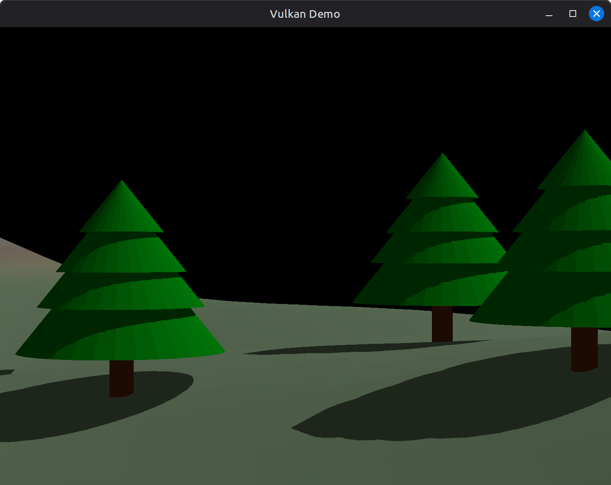

# Vulkan Lab
A modern, lightweight sandbox for learning and experimenting with Vulkan. Primarily built on Linux.



# Requirements
- Vulkan SDK
- CMake >= 3.28
- C++ 23 supporting compiler (e.g. GCC 13+)

# Build instructions
Using the provided platform scripts, for example:
```
# Configure and build (add -d for debug)
./build-linux.sh

# Clean build
./build-linux.sh -c
```

Alternatively, invoke CMake directly, for example:
```
cmake -B build
cmake --build build
```

# Running the demo
### Linux
```
./build/Release/bin/VulkanDemo
```

## License
This project is licensed under the MIT license (see [LICENSE](LICENSE))

This project makes use of the following 3rd party libraries:
- GLFW
- glm
- spdlog
- stb
- tinygltf
- VulkanMemoryAllocator

## Acknowledgements
This project, and learning Vulkan in general has been helped and inspired by some of the following resources:
- [vk_minimal_latest](https://github.com/nvpro-samples/vk_minimal_latest) - Best practice modern Vulkan development project
- [GODOT](https://github.com/godotengine/godot) - Multi-platform engine with Vulkan driver backends
- [3D Math Primer for Graphics and Game Development](https://gamemath.com/) - eBook written by Fletcher Dunn and Ian Parbery
